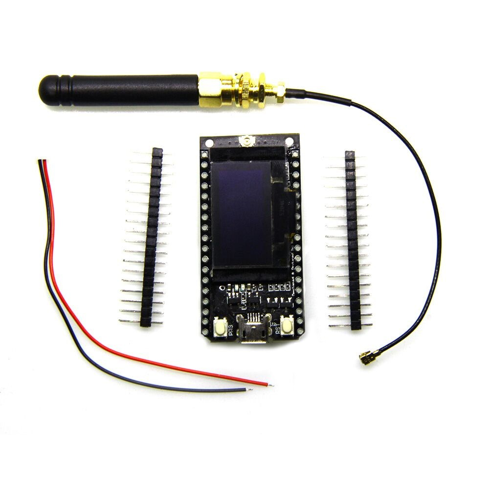
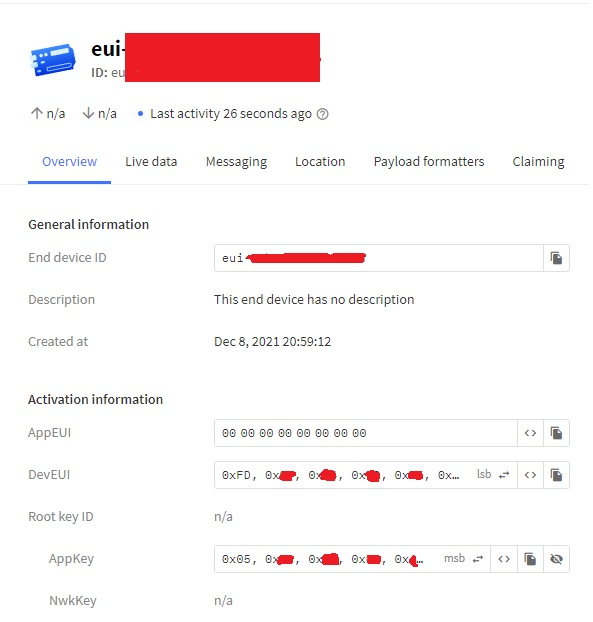

# Esp32 Upstream Lora  Demo

This code sample, provides simple guidance on how to get started sending data 
from your device to the IotBridge platform via Lora (The Things Stack).

## Requirements

1. PlatformIO
2. LILYGO® TTGO LORA32 868 Module
3. IotBridge Account & Device [Link](https://www.iotbridge.co.za)

## Credits

This example leverages heavily from the great example which can be found at [Link](https://github.com/lnlp/LMIC-node)

## Getting Started



First clone the repository. Once that is complete, open the solution in PlatformIO.

You now have to head over to your ThingsStack account and create a new device.
Once the device is created, you need to open the LoraKeys.h file and copy the values from the 
newly created device and paste them into the file.



Important Notice.

> If you have a public repository, do not commit the keys into your repository.
> They are private and should remain protected.

You can now simply build and upload the firmware to the device.

At this point you can log into the ThingsStack backend and verify on the device that it is receiving messages.
If you have not already linked your ThingsStack account in the IotBridge platform, follow this guide in our docs. [Link](https://docs.iotbridge.co.za/#/accounts-and-subscriptions/adding-things-stack-credentials)

## Device Magix Profile

You will need to create a profile for this sample. 
The Magix profile is code you need to write, in order to manipulate the incoming data, 
so that it can be used in our Platform.

### The decode function would look like this

```javascript
var bytesToInt = function (bytes) {
    var i = 0;
    for (var x = 0; x < bytes.length; x++) {
        i |= (bytes[x] << (x * 8));
    }
    return i;
};

var uint8 = function (bytes) {
    if (bytes.length !== uint8.BYTES) {
        throw new Error('uint8 must have exactly 1 byte');
    }
    return bytesToInt(bytes);
};
uint8.BYTES = 1;

var int16 = function (bytes) {
    if (bytes.length !== int16.BYTES) {
        throw new Error('int16 must have exactly 2 bytes');
    }
    var value = +(bytesToInt(bytes));
    if (value > 32767) {
        value -= 65536;
    }
    return value;
};
int16.BYTES = 2;

var int32 = function (bytes) {
    if (bytes.length !== int32.BYTES) {
        throw new Error('int32 must have exactly 4 bytes');
    }
    var value = +(bytesToInt(bytes));
    if (value > 2147483647) {
        value -= 4294967296;
    }
    return value;
};
int32.BYTES = 4;

var latLng = function (bytes) {
    return +(int32(bytes) / 1e6).toFixed(6);
};
latLng.BYTES = int32.BYTES;

var temp = function (bytes) {
    return +(int16(bytes));
};
temp.BYTES = int16.BYTES;

var altitude = function (bytes) {
    return +(int16(bytes));
};
altitude.BYTES = int16.BYTES;

var decodeBytes = function (bytes, mask, names) {

    var maskLength = mask.reduce(function (prev, cur) {
        return prev + cur.BYTES;
    }, 0);
    if (bytes.length < maskLength) {
        throw new Error('Mask length is ' + maskLength + ' whereas input is ' + bytes.length);
    }

    names = names || [];
    var offset = 0;
    return mask
        .map(function (decodeFn) {
            var current = bytes.slice(offset, offset += decodeFn.BYTES);
            return decodeFn(current);
        })
        .reduce(function (prev, cur, idx) {
            prev[names[idx] || idx] = cur;
            return prev;
        }, {});
};

function decode(message, metadata) {
   return decodeBytes(message.asBytes, [latLng, latLng, uint8, temp, altitude], ['latitude', 'longitude', 'sats', 'temp', 'altitude']);
}
```

### The convert function would look like this

```javascript
function convert(message, metadata)
{
    return {
        $location: {
            longitude: message.longitude,
            latitude: message.latitude
        },
        $telemetry: {
            sats: message.sats,
            tempC: message.temp,
            tempF: (message.temp * 1.8) + 32,
            altitude: message.altitude
        }
    };
}
```


